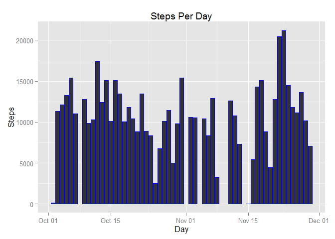
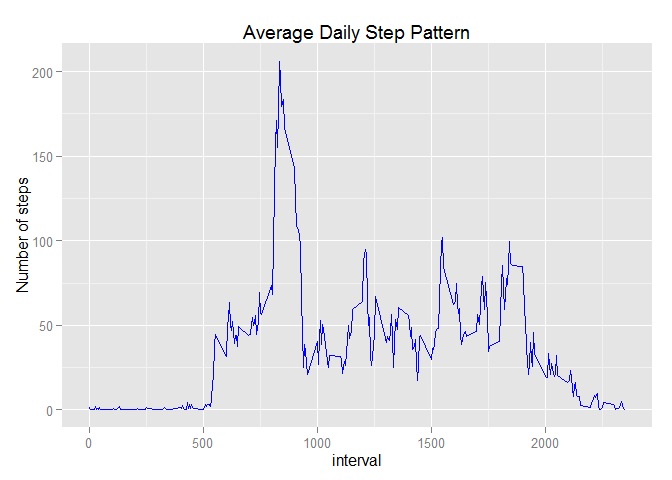
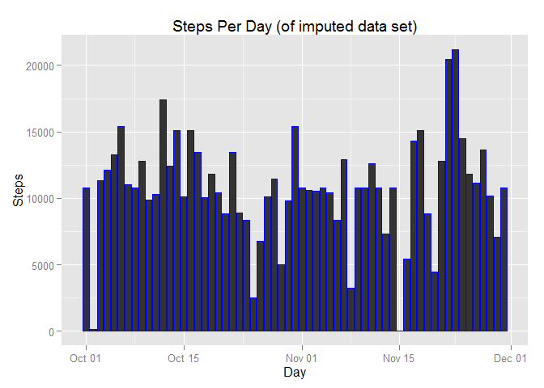

# Reproducible Research: Peer Assessment 1


####Load the library's used
I will be suppressing the messages generated during load. I have reviewed these messages and they provide no value. You may want to remove the message suppression when running on your system.

```r
suppressWarnings(suppressMessages(library(dplyr)))
suppressWarnings(suppressMessages(library(ggplot2)))
```

## Loading and preprocessing the data

```r
activity <- read.table(unz("activity.zip","activity.csv"),header = T,quote="\"", sep=",",na.strings = NA)
```


```r
activity$date <- as.Date(activity$date, format = "%Y-%m-%d ")
activity$interval <- as.factor(activity$interval)
activity$steps <- as.numeric(activity$steps)

activity <- cbind(activity,intervalgroup = as.integer(levels(activity$interval)) %/% 12)
```


## What is mean total number of steps taken per day?

```r
activity_stepday <- aggregate(steps ~ date, activity, sum)
colnames(activity_stepday) <- c("date","steps")

mean_steps <- format(mean(activity_stepday$steps, na.rm=TRUE),digits=2, nsmall=2, big.mark=",",small.mark=".")
median_steps <- format(median(activity_stepday$steps, na.rm=TRUE),digits=2, nsmall=2, big.mark=",",small.mark=".")
```
#####The mean number of steps per day is 10,766.19
#####The median number of steps per day is 10,765.00

######If we were to plot it out, it would looks like this

```r
ggplot(activity_stepday, aes(x = date, y=steps)) + 
         geom_histogram(color="blue",stat="identity") +
        labs(title="steps Taken per Day", 
             x = "Day", y = "Steps") 
```

 

## What is the average daily activity pattern?

```r
mean_stepsmean_intervalsteps <- aggregate(activity$steps,by=list(interval=activity$interval), 
                       FUN=mean, 
                       na.rm=TRUE)
                     
                       
names(mean_stepsmean_intervalsteps)<-c("interval","steps")
mean_stepsmean_intervalsteps$interval <- as.integer(levels(mean_stepsmean_intervalsteps$interval)[mean_stepsmean_intervalsteps$interval])
max_steps = max(mean_stepsmean_intervalsteps$steps)
max_interval= filter(mean_stepsmean_intervalsteps, steps==max_steps)$interval

ggplot(mean_stepsmean_intervalsteps, aes(x=interval, y=steps)) +   
        geom_line(color="blue") +  
        labs(title="Average Daily Step Pattern", x="interval", y="Number of steps")
```

 

####The interval that had the maximum average steps is 835 with a daily average of 206.17 steps.

## Imputing missing values

1.) The total number of missing rows can be easily determined by the getting the number of rows where the is.na is true in the steps column

```r
missing_rows <-format(nrow(activity[is.na(activity$steps),]),digits=2, nsmall=2, big.mark=",",small.mark=".")
```

#####There are 2,304 rows with NA values in the steps column

2.) To patch up the NAs is straight forward using the dplyr package. 

-group by interval 

-create a Mean col by interval 

-replace the NA's with the Mean 

-loose the temp column Mean 

This will be done in one piped statement


```r
activityfilled <- activity %>%
       group_by(interval) %>%
       mutate(Mean= mean(steps, na.rm=TRUE), 
               steps = replace(steps, 
                  which(is.na(steps)), first(Mean))) %>%
       select(-Mean)
```


```r
missing_rows <-format(nrow(activityfilled[is.na(activityfilled$steps),]),digits=2, nsmall=2, big.mark=",",small.mark=".")
```

#####After imputing the data, the resulting set shows 0 rows with NA values in the steps column


Here I will create an average steps per day sum on the filled data set, and plot it.


```r
activityfilled_stepday <- aggregate(steps ~ date, activityfilled, sum)
colnames(activityfilled_stepday) <- c("date","steps")
ggplot(activityfilled_stepday, aes(x = date, y=steps)) + 
         geom_histogram(color="blue",stat="identity") +
        labs(title="steps Taken per Day", 
             x = "Day", y = "Steps") 
```

 


####Now that we have datasets to compare, let's look closer.


We calculate the mean and median of each. 


```r
activity_mean <- format(mean(activity_stepday$steps,na.rm = TRUE),digits=2, nsmall=2, big.mark=",",small.mark=".")
activity_median <- format(median(activity_stepday$steps,na.rm = TRUE),digits=2, nsmall=2, big.mark=",",small.mark=".")
activityfilled_mean <- format(mean(activityfilled_stepday$steps,na.rm = TRUE),digits=2, nsmall=2, big.mark=",",small.mark=".")
activityfilled_median <- format(median(activityfilled_stepday$steps,na.rm = TRUE),digits=2, nsmall=2, big.mark=",",small.mark=".")
```

The step mean of the original data set is 10,766.19, and the step mean of the filled data set is 10,766.19.
The step median of the original data set is 10,765.00, and the step median of the filled data set is 10,766.19.

## Are there differences in activity patterns between weekdays and weekends?
For my evaluation, I will use the intervalgroup column created earlier (grouping of 20 Intervals). I will graph the steps taken during the day for both weekdays and weekends. I will also compare the average steps per day for weekdays vs weekends. 


```r
 activity <- cbind(activity,weekday = tolower(weekdays(activity$date)))
 activity <- cbind(activity,daytype=ifelse((activity$weekday == "saturday" | 
                                     activity$weekday == "sunday"), "weekend", 
                                     "weekday"))
 we_stepday <- activity %>%
                 filter(daytype=="weekend")
 we_avg <- format(mean(aggregate(we_stepday$steps,by=list(date=we_stepday$date), 
                       sum, 
                       na.rm=TRUE)$x,na.rm=T),digits=2, nsmall=2)
 wd_stepday <- activity %>%
                 filter(daytype=="weekday")
 wd_avg <- format(mean(aggregate(wd_stepday$steps,by=list(date=wd_stepday$date), 
                       sum, 
                       na.rm=TRUE)$x,na.rm=T),digits=2, nsmall=2)

 activity_stepday <- aggregate(steps~interval+daytype, activity, mean)
 activity_stepday$interval <- as.integer(levels(activity_stepday$interval))
 ggplot(activity_stepday, aes(x=interval, y=steps)) + 
        geom_line(color="blue",) +
        facet_wrap(~ daytype, nrow=2, ncol=1) +
        labs(x="Interval", y="Number of steps") 
```

 

#####Yes. It appears that there is a there is fewer steps per day on the weekday. On the weekday the average steps taken per day is 8820.36. However on the weekend the average steps taken per day is 10855.75. Also activity appears to occur later in the day and more continuous on weekends       
       
